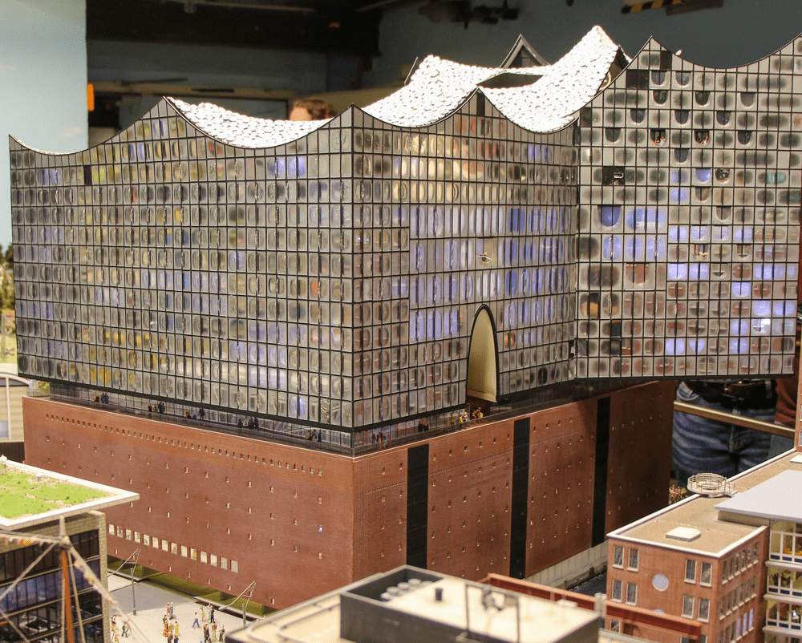
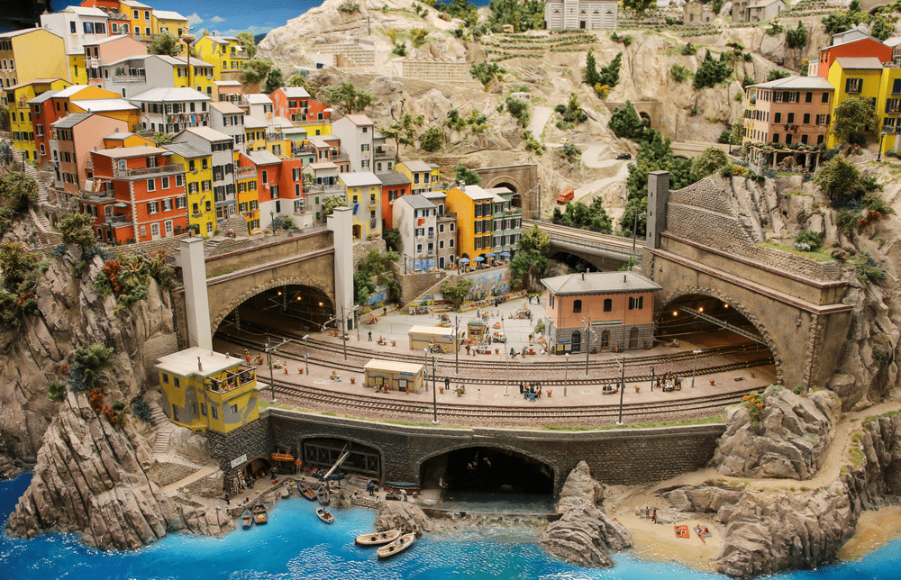
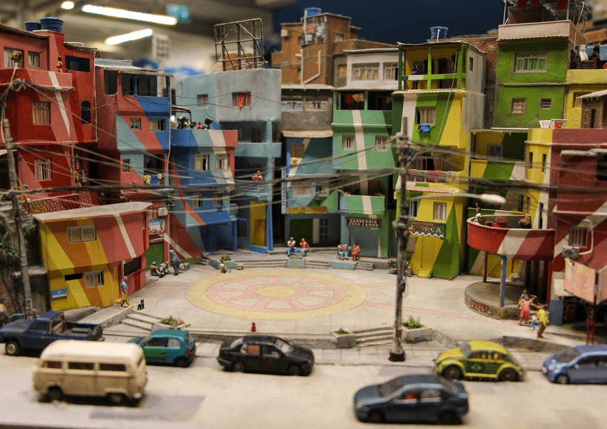
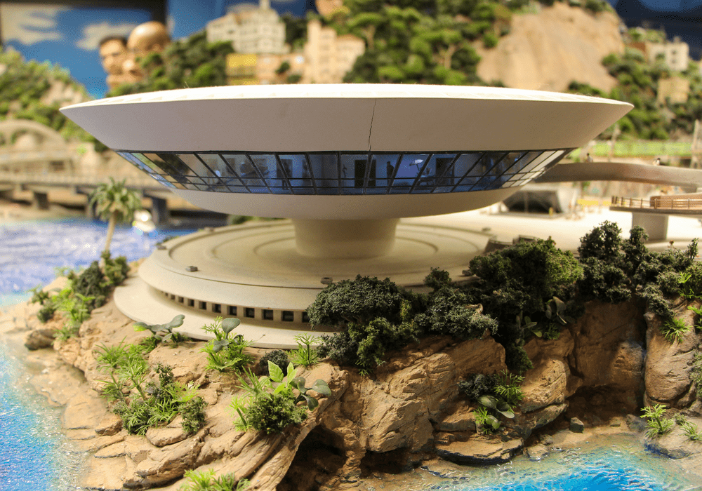

Son iki buçuk yıldır sıkça Hamburg’a yolum düşmesine rağmen, uzun zamandır gitmek istediğim Miniatur Wunderland’a bir türlü gidememiştim. Ancak, geçtiğimiz haftalarda nihayet bu arzum gerçekleşti. Haziran ayında yağmurlu, gri bir Hamburg sabahında kendimizi Miniatur Wunderland’ın büyülü dünyasına attık ve içeri adım attığımız anda yaşadığımız deneyim gerçekten nefes kesiciydi. Her şeyin küçüklüğü karşısında büyülenmiş ve birkaç adımda bir farklı bir ülkeye geçmenin heyecanını doya doya yaşamıştık. Sadece dört saat içinde Almanya’dan Avusturya’ya, oradan İtalya’ya, İtalya’dan da Brezilya’ya yolculuk yapmıştık. Bu minik dünyanın içinde kaybolmak ve her detayı incelemek, bize gerçek dünyadan bir an'lığına da olsa kaçma fırsatı sundu. 

<figure>
    
    <figcaption style="color: gray; font-size: 15px;">Elbphilharmonie, Hamburg</figcaption>
</figure>

Şimdi, bu büyülü dünyanın aklımda kalan bazı yapılarından ve an'larından bahsetmek istiyorum. İlk olarak, Elbphilharmonie’yi görünce yeniden büyülendim. Dünyanın en modern konser salonlarından biri olarak bilinen Elbphilharmonie, burada 2500 LED ışık ile donatılmış ve tam 350.000 € maliyetle yapılmış bir model olarak karşımıza çıkıyordu.

Bu detaylar, modelin ne kadar özenle ve titizlikle hazırlandığını gözler önüne seriyordu. Ardından, İtalya’da bulunan ve UNESCO Dünya Kültür Mirası Listesi’nde yer alan Cinque Terre’nin bir parçası olan Riomaggiore’ye vardık. İki tarafı tünellerle biten bu muhteşem yer, dakikalarca treni izlediğim ve adeta kendimi oradaymış gibi hissettiğim bir noktaydı.

<figure>
    
    <figcaption style="color: gray; font-size: 15px;">Cinque Terre, İtalya</figcaption>
</figure>

Brezilya’ya geçtiğimizde ise Favela bizi karşıladı. Favela hakkında, binalardan elektrik şebekelerine kadar her şeyin burada yaşayanlar tarafından yapıldığı ve bir ailenin büyüdüğünde evinin üstüne bir kat daha eklediği bilgisine yer veriliyordu.

<figure>
    
    <figcaption style="color: gray; font-size: 15px;">Favela, Brezilya</figcaption>
</figure>

Hemen yanında ise Copacabana Palace’ı görmek mümkündü. 1923'te açılışından bu yana Art Deco tarzındaki bu büyük otel, Hollywood yıldızlarından ünlü şarkıcılara, hatta mafya patronlarına kadar birçok ismi ağırlamış. Bununla birlikte, Rio’da birçok ünlü yapı tasarlayan Oscar Niemeyer tarafından tasarlanan Niteroi Çağdaş Sanat Müzesi’nin her detayı da ilgi çekiciydi.

<figure>
    
    <figcaption style="color: gray; font-size: 15px;">Niteroi, Brezilya</figcaption>
</figure>

Şimdi fotoğrafını eklememiş olsam da bahsetmek istediğim birkaç yapı daha var. Salzburg yakınlarında, Oberndorf’ta bulunan Silent Night Chapel’ini de görme fırsatımız oldu. Burası, 1818 Noel arifesinde “Silent Night” şarkısının ilk kez seslendirildiği yer olarak biliniyor ve modelde bu tarihsel öneme sahip yapının her detayı titizlikle işlenmişti. Son olarak, Bavyera’daki Neuschwanstein Kalesi’nin modeline hayran kaldık. Orijinal planlarıyla inşa edilen bu model, 1:120 ölçeğinde ve tam 1911 adet karton parçasından oluşturulmuş. Gerçekliğe bu denli yakın bir çalışmayı görmek, bu minik dünyanın ne kadar büyük bir emekle yaratıldığını gösteriyordu. 

Miniatur Wunderland, sadece bir sergi değil, aynı zamanda farklı kültürleri ve mimarileri bir arada deneyimleme fırsatı sunan bir mekân. Her köşesinde farklı bir hikâye ve tarih barındıran bu büyülü dünyayı keşfetmek, Hamburg’a yapılan her ziyaretin olmazsa olmazlarından biri olmalı. İçerdiği pek çok yapı ve her ayrıntısıyla görülmeye değer, büyüleyici bir yer olan Miniatur Wunderland’da geçirdiğimiz bu unutulmaz saatler, gerçekten de zamanın nasıl geçtiğini unutturdu. Eğer yolunuz Hamburg’a düşerse, siz de bu büyülü dünyayı keşfetmeyi ihmal etmeyin.