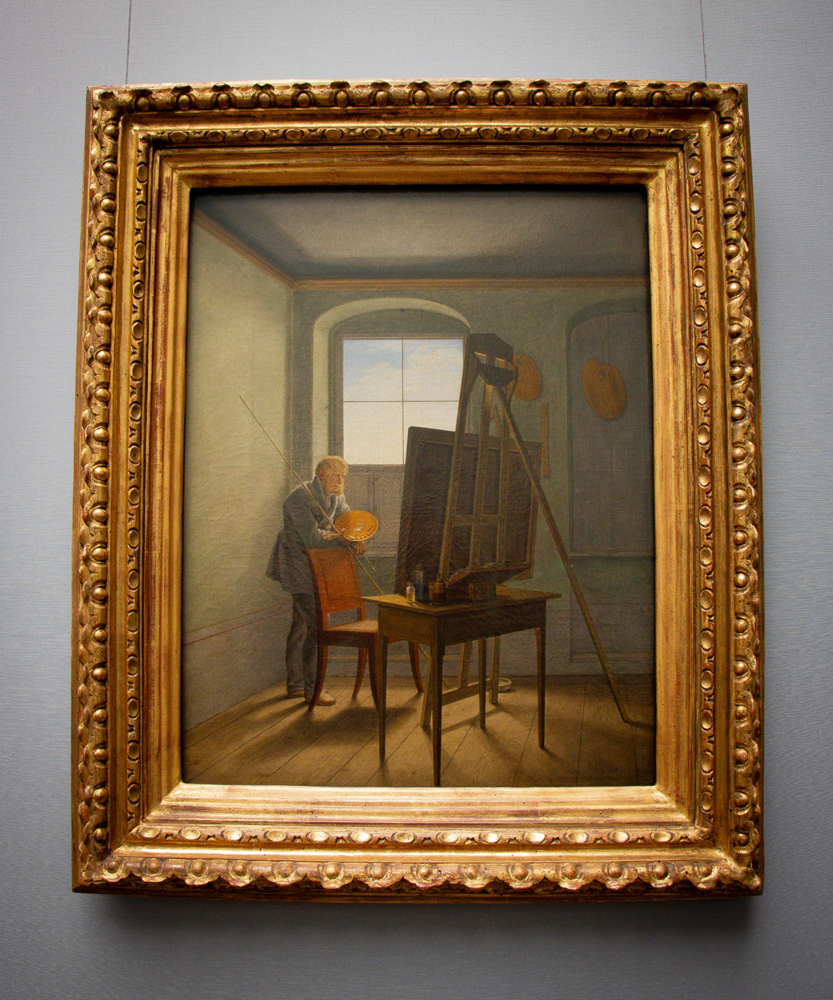
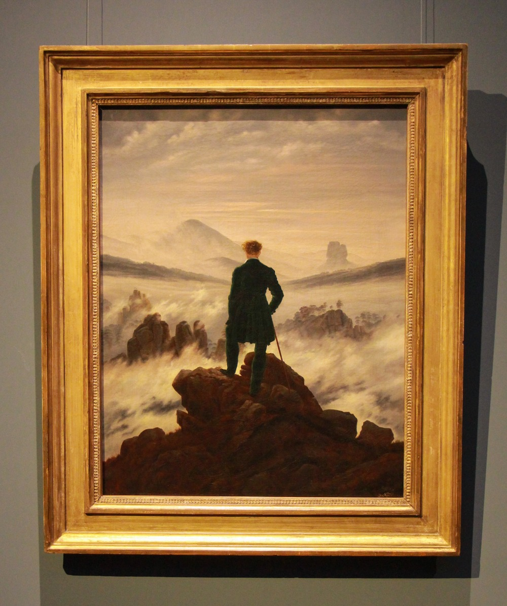
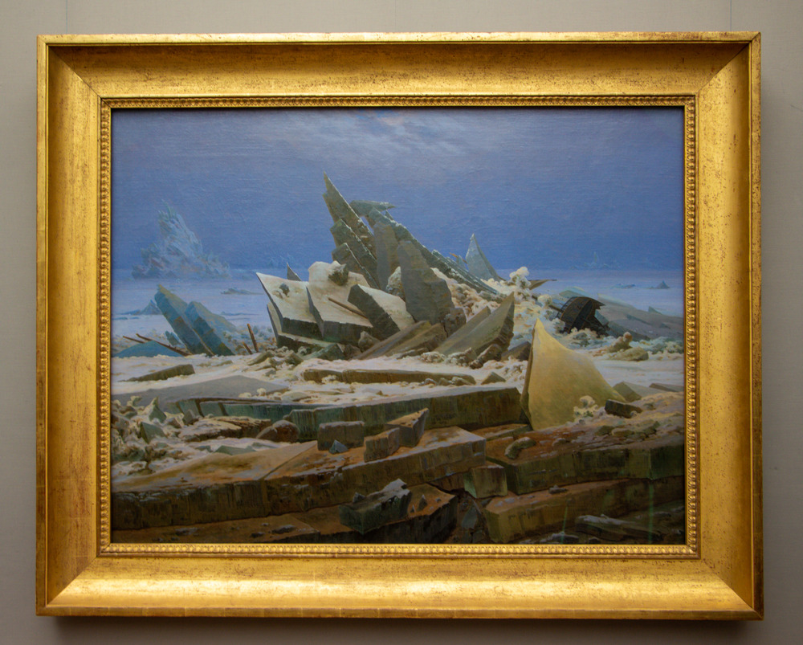
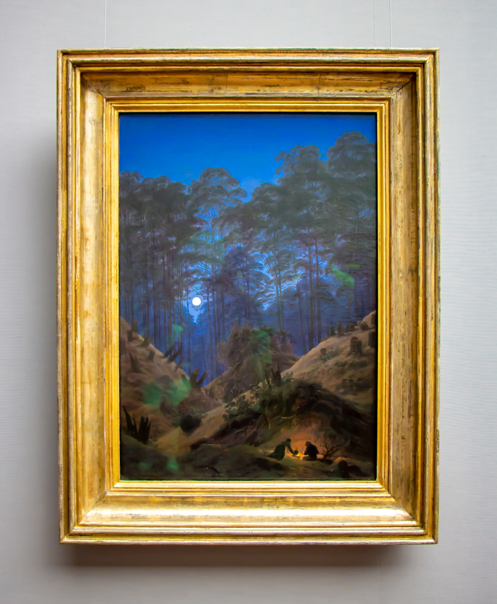

Gündelik dertlerden sıyrılmak için bir hafta sonumuzu Caspar David Friedrich sergisine giderek geçirmeye karar verdik. Berlin’de her ayın ilk pazar günü, Museumsonntag olarak bilinen gün, çoğu müzeye giriş ücretsiz oluyor. Önceden bu müzelere online bilet almak mümkündü ancak artık çoğuna online bilet alınamıyor ve kapıda sıra bekleyerek giriliyor. Azimle yaklaşık 45 dakika sıra bekleyerek müzeye girmeyi başardık. Caspar David Friedrich’in resimlerini daha önce Dresden, Roma ve Hamburg’da görme şansım olmuştu. Ancak o zamanlar her sanat müzesini dikkatle gezemiyordum; sadece yüzeysel bir bakış attığımı hatırlıyorum. Bu sefer ise eserlere odaklanarak, her birini dikkatle inceledim. Friedrich’in büyülü dünyasında kaybolarak, doğanın derinliklerine yaptığı yolculuğa ortak oldum. Yeşil ağaçların umudu ve teselliyi ifade ettiği resimlerinde, ormanın içine süzülen büyülü ışığın etkisi altında, içimin tazelendiğini hissettim. Bu sergi, sadece bir sanat deneyimi değil, aynı zamanda bir yolculuktu benim için.

<figure>
    
    <figcaption style="color: gray; font-size: 15px;">Caspar David Friedrich in His Studio</figcaption>
</figure>

Caspar David Friedrich deyince, 250 yıl önce doğmuş bir sanatçının derin dünyasına adım atıyoruz. Onun resimleriyle karşılaştığımda, insan yaşamı ve sonluluğu hakkında sorular sormaktan kendimi alamadım. Pek çok resminde sırtları bize dönük olarak resmettiği figürler, kendileri için bir sır olarak gözüken enginliğe bakıyorlardı. Bu figürler, Friedrich’in sessiz resimlerinde şu soruyu gündeme getiriyor: İnsan, dünyaya kıyasla nerede duruyor? Resimleri, yalnızca göze değil, aynı zamanda kalbe ve zihne de hitap ediyor. Örneğin, Wanderer Above the Sea of Fog resmi insanın doğa karşısındaki duruşunu ve içsel yolculuğunu gözler önüne seriyor. Friedrich’in eserleri, bizleri kendi varoluşumuzu sorgulamaya ve evrenle olan ilişkimiz üzerine derin düşüncelere sevk ediyor.

<figure>
    
    <figcaption style="color: gray; font-size: 15px;">Wanderer Above the Sea of Fog</figcaption>
</figure>

Doğayı seven Friedrich, sık sık doğada zaman geçirirmiş. Greifswald adlı sahil kasabasından gelen Friedrich, ömrünün büyük bir bölümünü Dresden’de, dağlık manzaralardan çok uzak olmayan bir yerde geçirmiş. Sanıyorum ki bu sebeple kıyı şeritleri ve dağ silsileleri, eserlerinin ana konuları haline gelmiş. Friedrich, şafak ve alacakaranlıkta renklerin büyüsünü incelemek için sabah erken ve akşam saatlerinde dışarıda olmayı tercih edermiş. Bu resimlere dikkatli baktığınızda, Friedrich’in ışığın en ince ruh hallerini tasvir etmeyi başardığını görürsünüz. Ağaçların ve çalıların çeşitli şekillerine, kayalara ve bulutlara dalarak geniş gökyüzü ve uzak ufuklarla dolu manzaralarında bunları yansıtıyor. Bu manzaralarda, mekan ve zamanın sonsuzluğu somut hale geliyor.

<figure>
    
    <figcaption style="color: gray; font-size: 15px;">The Sea of Ice</figcaption>
</figure>

Friedrich’in eserlerinde bir diğer tema ise orman gibi, ait olmanın bir sembolü olarak orman, onun yeşil ağaçları umut ve teselliyi yansıtıyor gibi. Resimlerinde ormanın içinden görünüm özellikle büyüleyici; görünür bir ufuk yok ve güneşten ya da aydan süzülen büyülü ışık ormanın içine giriyor. Gün batımının parıltısında kahverengi tarla, uzak dağların mavi alacakaranlığında kaybolan yalnız ova, bulut gölgelerinin dolaştığı nemli çayırlar, soluk bir bahar gününün gümüş kokusunu yayan yumuşak tepeler, sabah sislerinin yükseldiği Bohemya bölgesindeki dağlar bunların hepsi Friedrich’in resimlerinin konusu. 

<figure>
    
    <figcaption style="color: gray; font-size: 15px;">Forest in Interior by Moonlight</figcaption>
</figure>

Caspar David Friedrich’in resimleriyle geçirilen bu ziyaret, onun sanatının büyüsünü ve derinliğini keşfetmemi sağladı. Friedrich’in yarattığı dünyada doğanın görkemi, insanın varoluşsal soruları ve umut dolu orman manzaraları bir araya gelerek benzersiz bir sanat deneyimi sunuyor.